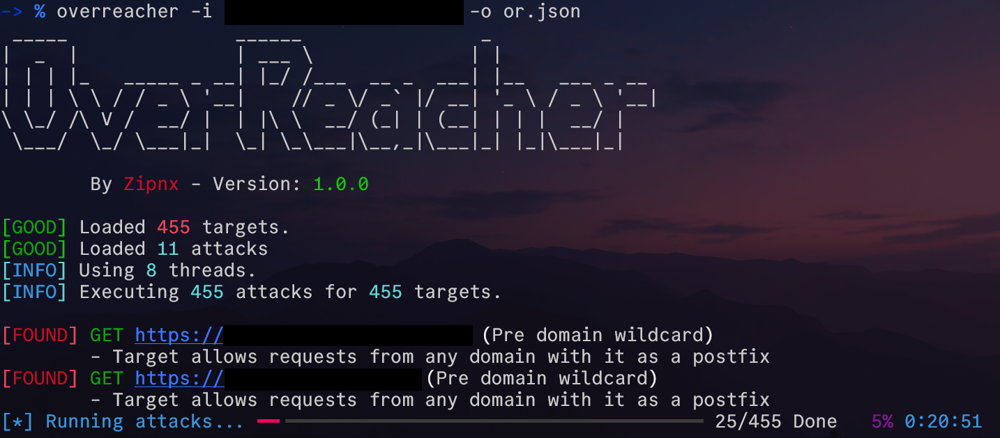

# OverReacher - A Convenient CORS Scanner


</img>

[comment]: 

OverReacher is a security research tool, meant to scan and find CORS misconfiguration vulnerabilities.

Made this tool based on functionality from [Corsy](https://github.com/s0md3v/Corsy)

## Getting Started

### Pipx install

OverReacher can be easily installed using:
```
pipx install overreacher
```

Afterwards you can check the usage with:
```
overreacher.py -h
```

### Manual install

TODO: Manual install, gtg

## Usage

An attack can be tested again a certain url or a comma separated list of urls as such:

`
python3 overreacher.py -u https://example.com/,https://google.com/
`

Alternatively the url's can be loaded from a file

`
python3 overreacher.py -i [FILE]
`

Or piped through stdin

`
cat exampleurlfile.txt | python3 overreacher.py 
`

## TODO:
In [TODO.md](./TODO.md)
